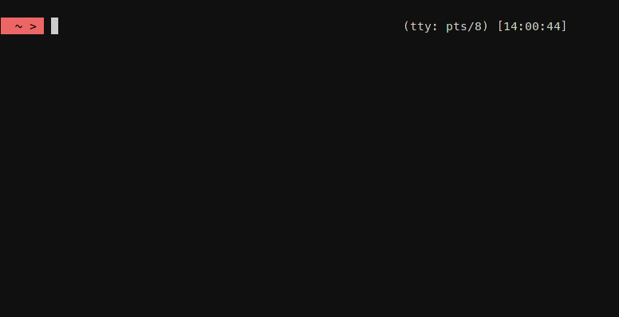

=========

 

 
 
 

A dead-simple, yet extensible, C and C++ unit testing framework.

## Philosophy

Most test frameworks for C require a lot of boilerplate code to
set up tests and test suites -- you need to create a main,
then register new test suites, then register the tests within
these suits, and finally call the right functions.

This gives the user great control, at the unfortunate cost of simplicity.

Criterion follows the KISS principle, while keeping the control
the user would have with other frameworks:

* [x] C99 and C++11 compatible.
* [x] Tests are automatically registered when declared.
* [x] Implements a xUnit framework structure.
* [x] A default entry point is provided, no need to declare a main
  unless you want to do special handling.
* [x] Test are isolated in their own process, crashes and signals can be
  reported and tested.
* [x] Unified interface between C and C++: include the criterion header and it *just* works.
* [x] There is a support for theories alongside tests
* [x] Progress and statistics can be followed in real time with report hooks.
* [x] TAP output format can be enabled with an option.
* [x] Runs on Linux, FreeBSD, Mac OS X, and Windows (Compiling with MinGW GCC and Visual Studio 2015+).

## Downloads

* [Linux (x86_64)](https://github.com/Snaipe/Criterion/releases/download/v1.3.1/criterion-v1.3.1-linux-x86_64.tar.bz2)
* [OS X (x86_64)](https://github.com/Snaipe/Criterion/releases/download/v1.3.1/criterion-v1.3.1-osx-x86_64.tar.bz2)
* [Windows (x86_64)](https://github.com/Snaipe/Criterion/releases/download/v1.3.1/criterion-v1.3.1-windows-x86_64.tar.bz2)

If you have a different platform, you can still [build the library from source](http://criterion.readthedocs.org/en/latest/setup.html#installation)

## Documentation

An online documentation is available on [ReadTheDocs][online-docs]
([PDF][pdf-docs] | [Zip][zip-docs] | [Epub][epub-docs])

## Samples

Sample tests can be found in the [sample directory][samples].

* [A simple test][sample-simple]
* [Using multiple suites][sample-suites]
* [Writing assertions][sample-asserts]
* [Adding test fixtures][sample-fixtures]
* [Tests with signals][sample-signal]
* [Using report hooks][sample-report]

## F.A.Q.

**Q. What's wrong with other C test frameworks?**  
A. I worked with CUnit and Check, and I must say that they do their job
   very well -- the only thing that bugs me is that setting up a test
   suite from scratch is a pain, it should really be simpler. Most
   (if not all) high-level languages have test frameworks with automatic
   test registration, but all the ones for C require you to set up a
   main, manually register suites, then tests. Criterion tries to
   fix these shortcomings.

**Q. Where has this been tested?**  
A. Currently, on Linux 2.6.32 and Linux 3.15.7, although it should work on
   most \*nix systems; Mac OS X Yosemite 10.10, FreeBSD 10.0, Windows 7 and 2K.

## Credits

Logo done by [Greehm](http://www.cargocollective.com/pbouigue)

[online-docs]: http://criterion.readthedocs.org/
[pdf-docs]: http://readthedocs.org/projects/criterion/downloads/pdf/latest/
[zip-docs]: http://readthedocs.org/projects/criterion/downloads/htmlzip/latest/
[epub-docs]: http://readthedocs.org/projects/criterion/downloads/epub/latest/

[samples]: ./samples/
[sample-simple]: ./samples/simple.c
[sample-suites]: ./samples/suites.c
[sample-asserts]: ./samples/asserts.c
[sample-fixtures]: ./samples/fixtures.c
[sample-signal]: ./samples/signal.c
[sample-report]: ./samples/report.c
